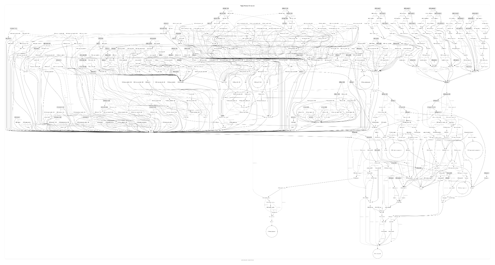
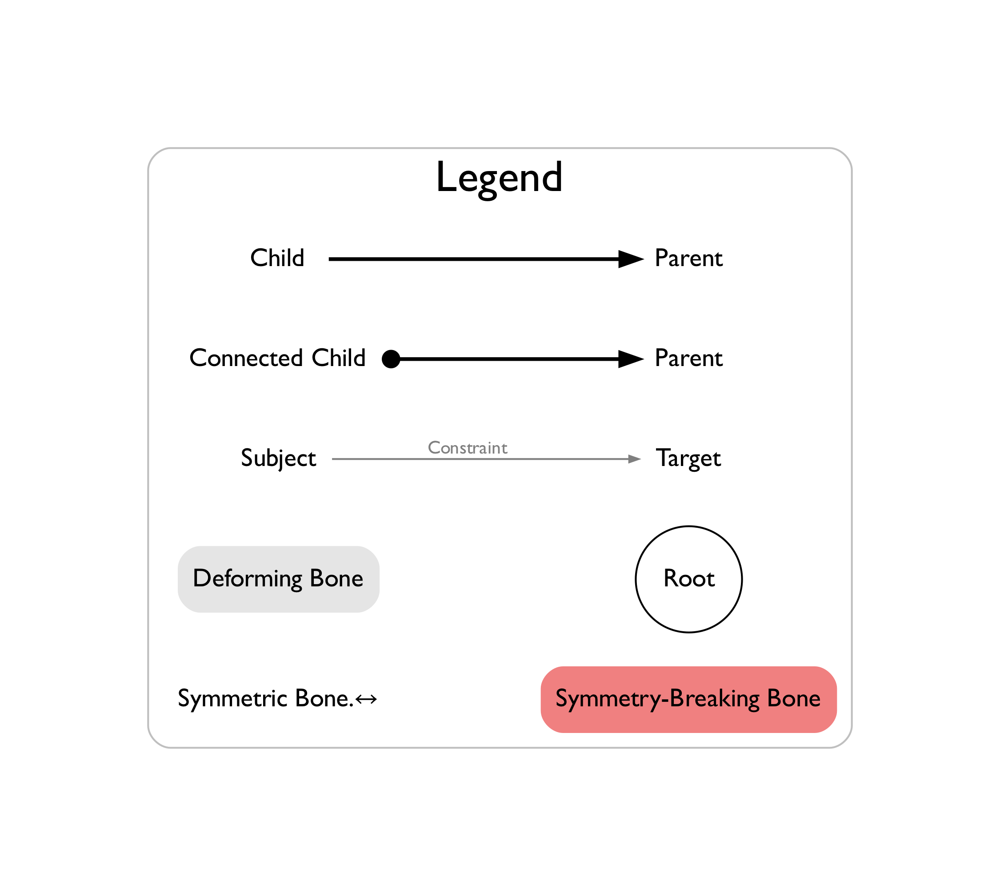

Blender Rig Graphviz
====================

This Blender add-on renders static graph images depicting the parent and
constraint relationships between scene objects (and their bones). Output images
are in PNG format. It requires that `Graphviz`_ be installed.

.. image:: docs/rig-rigify-shark.png

.. image:: docs/rig-rigify-quadruped-basic.png

.. image:: docs/rig-rigify-human-basic.png

.. _Graphviz: https://www.graphviz.org/

Installing Graphviz
-------------------

The add-on requires the `Graphviz`_ application to be installed and available
from the OS’s shell. (Otherwise, if you run any of the add-on’s operations in
Blender, you will get an error saying, “Graphviz has not been installed or is
not available from the system shell”.)

General instructions on `downloading Graphviz`_ are available on Graphviz’s
website.

Graphviz on Windows
~~~~~~~~~~~~~~~~~~~
In Windows, you can use Command Prompt and Microsoft’s built-in `winget tool`_
to download and install Graphviz: ``winget install graphviz``. You can also
`manually download a Windows installer`_ from Graphviz’s website.

Graphviz on macOS
~~~~~~~~~~~~~~~~~

In macOS, if you use either the Homebrew or MacPorts package managers, you can
use those: ``brew install graphviz`` or ``sudo port install graphviz``.

(If you use Homebrew, you might have to `start Blender from the command line`_
in order for the add-on to use Graphviz. This is because starting Blender from
the Finder might make Blender add-ons unable to see your Homebrew-modified
PATH environment variable – without which the add-on cannot access the Graphviz
application inside Homebrew’s ``/opt/homebrew/bin`` directory. Alternatively,
`configure the add-on`_’s Graphviz DOT Command preference to directly point to
the `dot` application, wherever it is installed.)

.. _PATH environment variable: https://en.wikipedia.org/wiki/PATH_(variable)

Graphviz on Linux
~~~~~~~~~~~~~~~~~

Various Linux package managers also support Graphviz. Use whatever is
appropriate for your flavor of Linux: ``sudo apt install graphviz``, ``sudo yum
install graphviz``, or whatever.

.. _downloading Graphviz: https://graphviz.org/download/

.. _winget tool: https://docs.microsoft.com/en-us/windows/package-manager/winget/

.. _manually download a Windows installer: https://www.graphviz.org/download/#windows

.. _start Blender from the command line: https://docs.blender.org/manual/en/latest/advanced/command_line/launch/index.html

.. _configure the add-on: #configure-the-add-on

Installing the add-on itself
----------------------------

1. `Install Graphviz`_ if you have not already done so.
2. Go to the `Releases page`_ and download the most recent release’s
   **blender_rig_graphviz.zip** asset. (Don’t open the ZIP file; just save
   it as a ZIP file somewhere.)
3. In Blender, open the Add-ons section in the Preferences window. (See also
   Blender’s documentation on `installing add-ons`_.)
4. Click on the Install… button, and use the File Browser to select the
   downloaded blender_rig_graphviz.zip file that you downloaded in Step 1.
   (You can delete the blender_rig_graphviz.zip file afterwards.)
5. Check if the add-on works:

   1. Create and save a Blender file.
   2. Create an armature with several bones.
   3. In a 3D Viewport, make active the armature object.
   4. The 3D Viewport’s menu bar, click Object → Rig Graphviz → Render Graph
      with All Bones. Watch the `Status Bar`_ for a result message.
   5. If no error appeared in the Status Bar, open an Image Editor in an area
      next to the 3D Viewport and browse the Blender file’s image data-blocks.
      There should already be an image data-block with the same name as the
      armature object; link that image to the Image Editor.
   6. The Image Editor should show a graph of your armature bones’
      relationships.
   7. Try the same operation after you add or remove more bones from the
      armature.
   8. Try the same operation on a mesh object parented to an empty. (Make sure
      that both the mesh object and the empty are selected in Object Mode, and
      make sure you switch the image linked in the Image Editor to the new
      graph image.)

.. _Releases page: https://github.com/js-choi/blender-rig-graphviz/releases

.. _installing add-ons: https://docs.blender.org/manual/en/latest/editors/preferences/addons.html#installing-add-ons

.. _Install Graphviz: #installing-graphviz

.. _Status Bar: https://docs.blender.org/manual/en/latest/interface/window_system/status_bar.html

Configuring the add-on
----------------------
The add-on has several preferences.

.. image:: docs/screenshot-preferences.png

* **Graphviz DOT Command**: The shell command to run the Graphviz DOT
  application. If you get a

  In Windows, the default value is ``C:\Program Files\Graphviz\bin\dot.exe``
  (which is the default location used by the Graphviz  installer for Windows).

  In Linux, the default value is ``dot``. This assumes that the ``dot`` command
  is available from one of the directories in the system shell’s `PATH
  environment variable`_.

  In macOS, the default value is ``dot``. This assumes that the ``dot`` command
  is available from one of the directories in the system shell’s `PATH
  environment variable`_. (If you use Homebrew on macOS, you might have to
  `start Blender from the command line`_ – or manually set the Graphviz DOT
  Command preference to the location of the DOT – in order for the add-on to
  use Graphviz. This is because starting Blender from the Finder might make
  Blender add-ons unable to see your Homebrew-modified ``PATH`` environment
  variable, without which the add-on cannot access the Graphviz application
  inside Homebrew’s ``/opt/homebrew/bin`` directory.)

* **Font Name**: A system font by this name must be visible to Graphviz. If
  this is blank, Graphviz will use an OS-dependent default font.

* **Output Directory**: If the output directory path starts with ``//``, then
  the ``//`` will be replaced by the current Blender file’s directory path.

* **Output Filename**: This is ``Rig Graphviz {{active_object_name}}`` by
  default. (Any ``{{active_object_name}}`` string in the filename will be
  replaced by the current active object’s name.) A “.png” file extension will
  also be automatically appended to the filename.

Using the add-on
----------------

The add-on adds a “Rig Graphviz” submenu to the 3D Viewport’s **Object menu**
in Object Mode, the **Armature menu** in armature Edit Mode, and the **Pose
menu** in Pose Mode. This submenu has these operators:

* **Render Graph with All Bones**: Render an image of parent and constraint
  relationships between **active/selected** scene objects (and **all** of their
  bones).

* **Render Graph with Visible Bones**: Render an image of parent and contsraint
  relationships between active/selected scene objects (and their **visible**
  bones).

* **Render Graph for Selected Bones Only**: Render an image of parent and
  constraint relationships between **selected bones** only. (This operation is
  available only when at least one bone is selected in armature Edit Mode or
  Pose Mode.)

* **Render Graph Legend**: Render an image called “Rig Legend.png”, explaining
  the rig graphs’ graphics. It is the same legend image shown in this
  document’s introduction, except it uses the font that is configured in the
  add-on’s preferences.

All of these operations will create a new PNG image file with the name and
location configured in the add-on’s preferences (or will overwrite any existing
image file with the same name and location). A result message will appear in
the `Status Bar`_ when the operation is finished.

Whenever the add-on creates an image file, it will also load the image file
into the current Blender file, so that you can view it in a Image Viewer, side
by side with your rig in a 3D Viewport. It will automatically update each time
you re-render a rig graph with the same filename.

(By default, the filename will be the active object’s name, and the directory
will be the current Blender file’s directory. If your current Blender file is
new and has not yet been saved, and if the add-on preferences’ output directory
is the default, then the add-on will show an error.)

Image backup files
~~~~~~~~~~~~~~~~~~

In addition, if there was any existing image that the add-on overwrote with the
new image, then the add-on also creates a backup image, named with consecutive
numbers – e.g., “Rig Graphviz Human Armature.0.png”, “Rig Graphviz Human
Armature.1.png”, etc.

Reading the graphs
~~~~~~~~~~~~~~~~~~

Rig graphs show parent and constraint relationships between selected objects
and/or their bones. It does not currently show drivers.

Pairs of bones that are **symmetric** are shown as one single “↔︎” bone. In
order for the add-on to consider two bones as symmetric:

* The two bones must have `opposite-sided names`_ of one another.

* The two bones must have the same parent (and that parent’s name must not be
  left- or right-sided) – or they must have two different parents that also
  have `opposite-sided names`_ of one another.

* The two bones must have matching constraints in the same order:

  * Each pair of constraints must have the same name.
  * Each pair of constraints must have the same target object.
  * If the constraints’ target object owns the constraints’ bones, then their
    subtarget names must both be blank, must be `opposite-sided names`_ of one
    another, or must be the same name (and the name must not be left- or
    right-sided).
  * If the constraints’ target object is another object that does not own the
    constraints’ bones, then their subtarget names must be the same.

This definition matches the behavior of the built-in `Symmetrize operation`_.

Any pair of bones that have `opposite-sided names`_ of one another but which
do not otherwise fulfill the criteria for symmetry are considered to **break
symmetry**. The add-on considers them to be an error in the armature and
therefore highlights them in red.

.. _opposite-sided names: https://docs.blender.org/manual/en/latest/animation/armatures/bones/editing/naming.html#naming-conventions

.. _Symmetrize operation: https://docs.blender.org/manual/en/latest/animation/armatures/bones/editing/symmetrize.html

Large rigs take a long time
~~~~~~~~~~~~~~~~~~~~~~~~~~~

Large, complex rigs may require considerable time to analyze, and the resulting
graph images may be large. Blender’s UI will be unresponsive during the
analysis. For example, Rigify’s default human rig contains hundreds of bones
and constraints. On a MacBook Air (M1, 2020), analysis and rendering of its rig
graph may freeze Blender’s UI for as many as twenty seconds before it finishes,
and it creates an approximately 20-MB PNG image (33,000 px × 18,000 px). (You
can see the complete image at `docs/rig-rigify-human.png`_.) It is thus
recommended that only selected bones be rendered when working with very complex
armatures.

.. _docs/rig-rigify-human.png: https://github.com/js-choi/blender-rig-graphviz/raw/main/docs/rig-rigify-human.png

Error troubleshooting
---------------------

.. _preference: #configuring-the-add-on

This Blender file has not yet been saved
~~~~~~~~~~~~~~~~~~~~~~~~~~~~~~~~~~~~~~~~

This error occurs when your Output Directory `preference`_ is set to ``//``
(its default value), but you have not yet saved the Blender file. The ``//``
indicates the current Blender file’s directory, but because the current Blender
file has not yet been saved, it has no output directory.

To fix this, simply save the Blender file into a directory. Alternatively, you
can change the Output Directory to a specific directory.

The Rig Graphviz add-on’s output directory path is is invalid
~~~~~~~~~~~~~~~~~~~~~~~~~~~~~~~~~~~~~~~~~~~~~~~~~~~~~~~~~~~~~

.. image:: docs/screenshot-error-invalid-directory-path.png

This error occurs when your Output Directory `preference`_ is set to an invalid
directory path. For example:

* The output directory path might be blank.
* The output directory path might not start with ``/`` in Linux and macOS.

To fix this, change the output directory to something valid, like ``//`` for the
current Blender file’s directory, or use the File Browser to choose a specific
directory.

Graphviz has not been installed or is not available from the system shell
~~~~~~~~~~~~~~~~~~~~~~~~~~~~~~~~~~~~~~~~~~~~~~~~~~~~~~~~~~~~~~~~~~~~~~~~~

This error occurs when the add-on cannot find a Graphviz DOT application
specified by the Graphviz DOT Command `preference`_.

First, make sure that you have `installed Graphviz`_.

Next, change your Graphviz DOT Command `preference`_ to point to your installed
Graphviz DOT executable file:

* In Windows, Graphviz installs the DOT executable file to ``C:\Program
  Files\Graphviz\bin\dot.exe`` by default.
* In Linux and macOS, the location of the DOT executable file depends on the
  package manager you used to install Graphviz. Common locations include
  ``/usr/local/bin/dot``, ``/usr/bin/dot``, ``/bin/dot``, and
  ``/opt/homebrew/bin/dot``.

(In Linux and macOS, the default value of the Graphviz DOT Command `preference`_
is ``dot``. This assumes that the ``dot`` command is available from one of the
directories in the system shell’s `PATH environment variable`_. In particular,
if you use Homebrew on macOS, you might have to `start Blender from the command
line`_ – or manually set the Graphviz DOT Command preference to the location of
the DOT – in order for the add-on to use Graphviz. This is because starting
Blender from the Finder might make Blender add-ons unable to see your
Homebrew-modified PATH environment variable, without which the add-on cannot
access the Graphviz application inside Homebrew’s ``/opt/homebrew/bin``
directory.)

.. _installed Graphviz: #installing-graphviz
